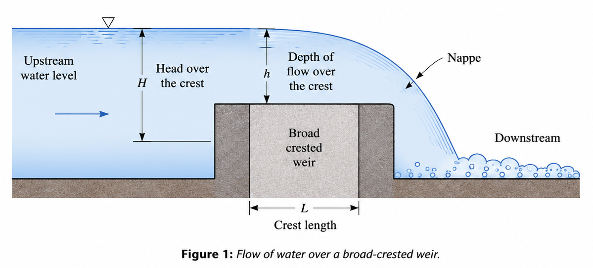
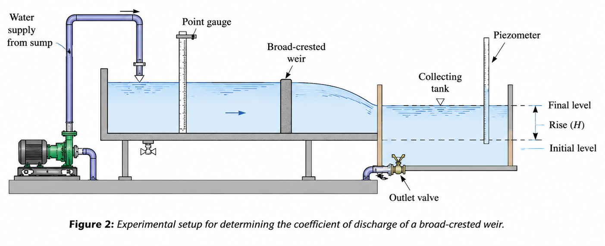

A weir is a hydraulic structure constructed across an open channel or river to raise the upstream water level and to measure or control the discharge of water. Water flows over the crest of the weir and falls freely on the downstream side. Weirs are widely used in irrigation systems, water supply networks, flood control structures, and hydraulic laboratories for flow measurement.

A broad-crested weir is a type of weir in which the width of the crest in the direction of flow is sufficiently large compared to the depth of water flowing over it. Generally, if the crest width is greater than about two and a half times the head of water over the crest, the structure is termed a broad-crested weir.

Unlike an orifice, through which water flows under pressure, water passes over the crest of a weir under the action of gravity. The sheet of water flowing over the crest is known as the **nappe**. Broad-crested weirs are preferred in many hydraulic applications because they provide stable flow conditions and relatively accurate discharge measurements.

The flow over a broad-crested weir is governed by the principles of conservation of mass and conservation of energy. As water approaches the crest, part of its potential energy is converted into kinetic energy. Under steady flow conditions, Bernoulli's theorem can be applied between the upstream section and the crest of the weir.

Bernoulli's equation is given by

$$
\frac{P}{\rho g}
+
\frac{V^2}{2g}
+
Z
=

\text{Constant}.
$$

Where:

- $P$ = Pressure of the fluid, $\mathrm{N/m^2}$,
- $\rho$ = Density of the fluid, $\mathrm{kg/m^3}$,
- $V$ = Velocity of flow, $\mathrm{m/s}$,
- $g$ = Acceleration due to gravity, $\mathrm{m/s^2}$,
- $Z$ = Elevation above a reference datum, $\mathrm{m}$.

For a broad-crested weir, the flow adjusts itself such that the discharge over the crest becomes maximum under critical flow conditions. Hydraulic analysis shows that the depth of flow over the crest for maximum discharge is related to the upstream head by

$$
h=\frac{2}{3}H,
$$

where

- $H$ = Total head of water above the crest,
- $h$ = Depth of flow over the crest.

The theoretical discharge over a broad-crested weir is given by

$$
Q_t=1.705LH^{3/2},
$$

where

- $Q_t$ = Theoretical discharge, $\mathrm{m^3/s}$,
- $L$ = Length of the crest measured perpendicular to the flow, $\mathrm{m}$,
- $H$ = Head of water above the crest, $\mathrm{m}$.

In practice, frictional effects and energy losses cause the actual discharge to be slightly less than the theoretical discharge. The actual discharge is determined experimentally by collecting water over a known period of time and is given by

$$
Q_a=\frac{AH}{t},
$$

where

- $Q_a$ = Actual discharge,
- $A$ = Plan area of the collecting tank,
- $H$ = Rise of water level in the collecting tank,
- $t$ = Time required for the rise.

The coefficient of discharge is defined as

$$
C_d=\frac{Q_a}{Q_t},
$$

where

- $Q_a$ = Actual discharge,
- $Q_t$ = Theoretical discharge.

The coefficient of discharge accounts for the effects of viscosity, turbulence, and other hydraulic losses and provides a measure of the efficiency of the weir as a flow-measuring device.

<em>Figure 1: Flow of water over a broad-crested weir.</em>

The experimental setup consists of a broad-crested weir installed across an open channel. Water is supplied to the channel at different flow rates, and the upstream water level is measured to determine the head over the crest. The discharge is measured by collecting the outflow in a measuring tank over a known period of time. The theoretical discharge is calculated using the broad-crested weir equation, and the coefficient of discharge is determined by comparing the actual and theoretical values.

<em>Figure 2: Experimental setup for determining the coefficient of discharge of a broad-crested weir.</em>

A graph of actual discharge, $Q_a$, versus $H^{3/2}$ is plotted to study the discharge characteristics of the weir. Under ideal conditions, the relationship between discharge and the head over the crest follows the theoretical expression

$$
Q\propto H^{3/2}.
$$

Broad-crested weirs are extensively used in rivers, canals, irrigation channels, spillways, and water treatment facilities for regulating water levels and measuring discharge. The determination of the coefficient of discharge enables engineers to accurately estimate flow rates and design efficient hydraulic structures.
